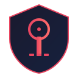

<p align="center">
  
</p>

# Token Guardrail

[](https://github.com/Operative-001/token-guardrail/actions/workflows/test.yml)
[](LICENSE)
[](https://www.npmjs.com/package/token-guardrail)

> Turn secret scanner findings into owner-assigned revoke/rotate actions.

## Round 1 MVP
- Secret finding ingestion (JSON/CSV)
- Token type classification + blast radius estimation
- Action queue: `REVOKE_NOW` / `ROTATE_NOW` / `MONITOR`
- Slack digest and ticket payload generation
- Audit logging

## Quickstart
```bash
npm install
npm test
node src/cli.js --input examples/findings.json --top 10
```

## API
### `GET /health`
Returns service health.

### `POST /ingest`
Body:
```json
{"findings":[{"id":"f1","repo":"org/repo","secret":"ghp_xxx","path":".env"}]}
```
Ingests scanner findings.

### `POST /analyze`
Builds prioritized action queue.

### `GET /queue`
Returns queued remediation actions.

### `GET /tickets`
Returns issue-tracker payloads derived from queue actions.

### `POST /notify/slack`
Body:
```json
{"webhook_url":"https://hooks.slack.com/services/..."}
```
Sends digest to Slack (or uses `SLACK_WEBHOOK_URL`).

### `GET /audit`
Returns audit trail events.

## Commercial License
This software is free for personal and non-commercial use.

For commercial/business use, open an issue with subject:
`[COMMERCIAL LICENSE INQUIRY]`
